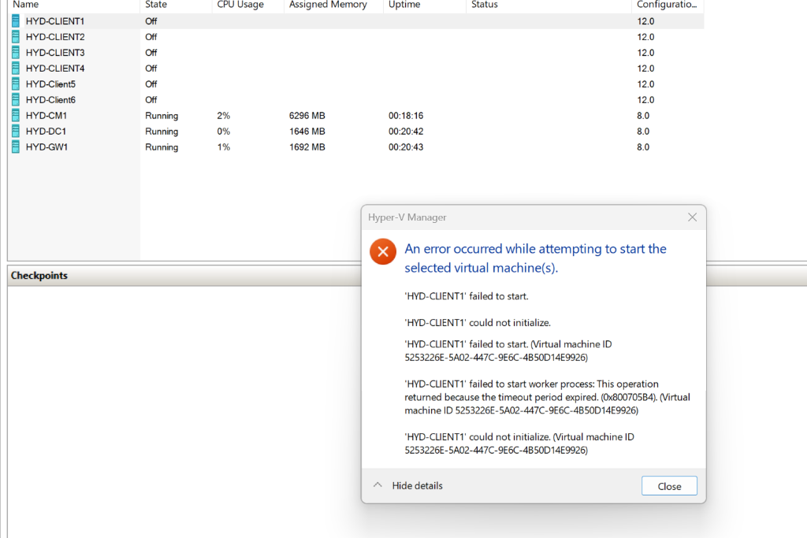

# MECM Lab Fix

This repository contains utility scripts for the **Windows 11 and Office 365 Deployment Lab Kit**.

**Lab Link:** [Windows 11 and Office 365 Deployment Lab Kit](https://learn.microsoft.com/en-us/microsoft-365/enterprise/modern-desktop-deployment-and-management-lab?view=o365-worldwide)

---

## 1. Fix Client VM Startup Errors (`fix-client-vms.ps1`)

### Problem
When starting client VMs (`HYD-CLIENT1` through `HYD-Client6`) after setup or reinstallation, Hyper-V throws the following initialization error:

> **An error occurred while attempting to start the selected virtual machine(s).**  
> `'HYD-CLIENT1' failed to start worker process: This operation returned because the timeout period expired. (0x800705B4).`



### Cause
1. **Orphaned Worker Processes & File Locks (`0x80070020`)**: Previous failed startup attempts or setup routines leave background `vmwp.exe` worker processes running. These processes maintain open file locks on `WindowsParent.vhdx` and client differencing disks in `C:\Win11_25H2_Lab`.
2. **Corrupted Guest State (`.vmgs`)**: Stale runtime state files in `C:\ProgramData\Microsoft\Windows\Hyper-V` cause Hyper-V initialization to hang until the 30-second timeout.

### Solution
The script [`fix-client-vms.ps1`](./fix-client-vms.ps1):
- Identifies and terminates orphaned `vmwp.exe` processes to release file locks on `WindowsParent.vhdx`.
- Removes corrupted/stale Hyper-V VM definitions while preserving all underlying `.VHDx` disk files.
- Recreates clean Generation 2 VM definitions configured with **vTPM**, **Dynamic Memory (2GB - 4GB)**, and **2 Virtual Processors**, attached to `HYD-CorpNet`.
- Starts `HYD-CLIENT1` to verify clean operation.

### Run
In an **Administrator PowerShell** session:
```powershell
powershell -ExecutionPolicy Bypass -File .\fix-client-vms.ps1
```

---

## 2. Share Work Wi-Fi with VMs via NAT Switch (`setup-wifi-nat-switch.ps1`)

### Problem
Creating a Hyper-V **External Virtual Switch** bound to a Wi-Fi adapter (e.g. Killer Wi-Fi 7) causes the host's Wi-Fi connection to drop instantly.

### Why This Happens
- **Wi-Fi / 802.11 Protocol Restrictions**: Wi-Fi networks allow only **one MAC address per wireless connection**. An External Switch attempts to pass multiple VM MAC addresses through the host Wi-Fi card. Corporate Wi-Fi routers (with 802.1X / MAC filtering) reject this and drop the connection.
- **Bridge Driver Conflict**: Hyper-V's Virtual Switch bridge filter driver causes wireless card drivers to drop association.

### Solution
Use an **Internal Virtual Switch + Windows NAT (Network Address Translation)** instead of an External Switch.

The script [`setup-wifi-nat-switch.ps1`](./setup-wifi-nat-switch.ps1):
- Configures `HYD-InterNet` as an **Internal** Virtual Switch.
- Assigns IP `192.168.16.1/24` to the host's virtual interface.
- Configures Windows NAT (`HYD-Lab-NAT`) for subnet `192.168.16.0/24`.
- **Result**: VMs route through your host's existing Wi-Fi connection using your laptop's authenticated single MAC address. Wi-Fi **never drops**.

### Run
In an **Administrator PowerShell** session:
```powershell
powershell -ExecutionPolicy Bypass -File .\setup-wifi-nat-switch.ps1
```

---

## 3. Fix CM1 Routing (`fix-cm1-routing.ps1`)

### Problem
The `HYD-CM1` VM has two active NICs:
- `Ethernet` (corp/private network)
- `Ethernet 2` (internet/NAT network)

A stale default route on the private NIC and equal automatic interface metrics cause Windows to evaluate the wrong network path first, introducing delays for internet-bound traffic.

### Solution
The script [`fix-cm1-routing.ps1`](./fix-cm1-routing.ps1):
1. Removes the default route (`0.0.0.0/0`) from the private/corp NIC (`Ethernet`).
2. Disables automatic interface metrics.
3. Sets manual metrics so internet is always preferred:
   - `Ethernet 2` (internet): metric `10`
   - `Ethernet` (corp/private): metric `500`

### Run
In an **Administrator PowerShell** session:
```powershell
powershell -ExecutionPolicy Bypass -File .\fix-cm1-routing.ps1
```

---

## 4. Disable Windows Updates in Guest VMs (`disable-guest-updates.ps1`)

### Problem
In a lab environment managed by MECM / ConfigMgr, guest VMs connected to the internet via the NAT gateway can trigger unwanted automatic Windows Updates. This consumes bandwidth, alters baseline lab configurations, and causes unexpected reboots.

### Solution
The script [`disable-guest-updates.ps1`](./disable-guest-updates.ps1):
- Configures Group Policy registry keys (`NoAutoUpdate = 1`, `AUOptions = 1`, `DoNotConnectToWindowsUpdateInternetLocations = 1`).
- Stops and disables `wuauserv` (Windows Update), `usoServ` (Update Orchestrator), `bits`, and `dosvc`.
- Disables scheduled tasks under `\Microsoft\Windows\UpdateOrchestrator\` and `\Microsoft\Windows\WindowsUpdate\`.

### Run Inside Guest VM
In an **Administrator PowerShell** session inside the target guest VM:
```powershell
powershell -ExecutionPolicy Bypass -File .\disable-guest-updates.ps1
```

---

## 5. Lab Cleanup (`cleanup_lab.ps1`)

If you need to reinstall the lab and want to remove existing VMs and Virtual Switches to avoid conflicts, use [`cleanup_lab.ps1`](./cleanup_lab.ps1).

### Run
In an **Administrator PowerShell** session:
```powershell
powershell -ExecutionPolicy Bypass -File .\cleanup_lab.ps1
```